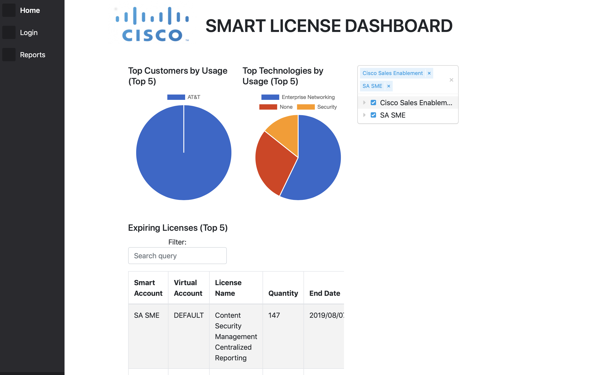
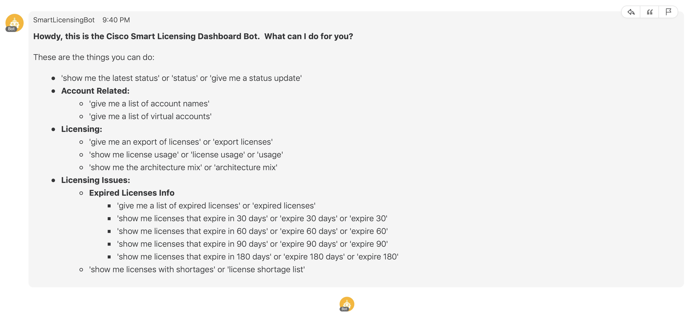

# Smart-Licensing-Dashboard

## Business/Technical Challenge

As Cisco undergoes the transformation to recurring offers and software-hardware disaggregation, protecting our software intellectual property and against malicious use is paramount. By now you probably heard Cisco is moving to a new approach for software licensing – **SMART LICENSE**. Smart Licensing was created to simplify the customer experience and provide greater insight into software license ownership and consumption.

Cisco is moving quickly towards strictly enforcing smart licensing. At the same time, there are many end-of-life announcements on existing licensing approaches (PAK, trust basis, etc.). However, customer journeys towards smart licensing have been very challenging. Reality is that smart licensing adds operational costs to our customers. On the other hand, our service providers, partners, and large enterprises customers are not being able to realize the proclaimed smart license benefits from the Cisco provided platforms (Cisco Smart Software Manager and Smart Software Manager On-Prem).

When discussing smart licensing, customers in general, and in particular Managed Service Providers (MSPs), are asking: *“What is in it for me?”*. Our challenge is how to leverage our CSSM and Webex Teams platforms and APIs to make smart licensing not only easy to use from an operational perspective. But also, we want to give customers compelling reasons (and tools) for wanting to move towards smart licensing; thus making a win-win for Cisco and our customers.

## Proposed Solution

The solution to this business challenge is the Smart Licensing Dashboard (SLD).  The SLD is composed of two main components:
* The Smart Licensing Dashboard - Check it out [here](https://www.easysmartaccounts.com:10000/#/). 
* The Smart Licensing Bot - Can be added to a Webex Teams Space.  Once you add it, just type help and you can start interacting with it.

The Smart Licensing Dashboard first connects to Cisco’s Single Sign On service to get authenticated. Then we query our Smart Software Manager that runs in the Cisco Cloud for licensing data.   We cache this data in Redis to make the dashboard UI fast and more responsive.  The dashboard allows the user to select and view multiple Smart Accounts at once and filter based on the top 5 expired licenses.  Other filters based on customer's needs can be easily added. 

Also in the solution we have a Smart Licensing Bot. The bot interfaces with 3 different components. 

1. Cisco Teams Infrastructure  
2. Smart Licensing Backend 
3. Cisco Smart Software Manager

The Smart Licensing Bot (bot) provides an intuitive and easy to use interface to your [Cisco Smart Software Manager (CSSM)](https://www.cisco.com/c/en/us/buy/smart-accounts/software-manager.html) smart accounts via integration with the industry leading and extremely useful [Webex Teams](https://www.cisco.com/c/en/us/solutions/collaboration/webex-teams.html) application.

Essentially the bot acts on behalf of the user, pulling useful information from CSSM and then reformatting in summary form for viewing on a Webex Team Client.


### Cisco Products Technologies/ Services

The solution leverages the following Cisco technologies

* [Cisco Smart Software Manager](https://www.cisco.com/c/en/us/buy/smart-accounts/software-manager.html )
* [Webex Teams](https://www.cisco.com/c/en/us/solutions/collaboration/webex-teams.html)

## Team Members

* Ross Adams <rosadams@cisco.com> - FED-Air Force (Federal)
* Alex Daltrini <adaltrin@cisco.com> - AT&T Account (Telco & Mobile)
* Jim Durkin <jdurkin@cisco.com> - AT&T Account (Telco & Mobile)
* William Kurkian <wkurkian@cisco.com> - AT&T Account (Telco & Mobile)
* Tim Taylor <timtayl@cisco.com> - AT&T Account (Telco & Mobile)

## Solution Components

We provide three main solution components that enable user interaction with CSSM. They are the Smart Licensing Bot, Smart Licensing Dashboard Backend, and the Smart Licensing Dashboard GUI. They are shown in the diagram below.


### Smart Licensing Dashboard Backend

The backend is the primary component responsible for facilitating data access to the other components, It serves authentication requests as well as maintains authentication data. It's functions are:

- Receiving and sending authentication requests to Cisco SSO
- Maintaining a store of access tokens for different clients
- Caching and consolidating API data for faster data responses
- Providing a REST API for the GUI and Bot components.
- Creating a Webex Teams room for the bot upon user authentication

### Smart Licensing Dashboard Bot

The bot provides a chat interface users interact with through Webex Teams, and serves responses based on data from CSSM. See the Usage section for an example command. It's functions are:

- Watching for user commands in a Webex Teams room
- Generating responses to user commands from CSSM data
- Pulling data from CSSM using access tokens from the Dashboard Backend.
- Providing short term data caching for faster responses. 

### Smart Licensing Dashboard GUI

The GUI is a browser based client for users to interact with data from CSSM. It primarily interacts with Dashboard Backend. It's functions are:

- Interacting with Dashboard Backend API's to get CSSM data
- Initiating authentication by sending users to Cisco SSO.
- Showing views of the consolidated CSSM data, such as tables and charts
- Providing capability to filter data by Smart Accounts and Virtual Accounts. 

## Usage

### Prerequisite

This app requires a CSSM account with access to a Smart Account in order to access CSSM data, as well as a Webex Teams account linked to the same email. 

### Smart Licensing Dashboard GUI Usage

You can access the app [here](https://www.easysmartaccounts.com:10000/#/). For the best experience, please view the site at the default browser zoom level on a desktop client.

Just click the Login button on the site. You will then be taken through the Cisco Single Sign on process. Once that is complete, you can see data on the UI.
 
 
 In the center of the page is the relevant licensing information for your Smart Accounts.  At the top are pie charts that show your top customers by usage and the mix of technology/architecture.  On the right side of the page, you can filter the license information by Smart Account and Customers.
 
 In addition to showing you the relevant licensing information, the SLD Backend automatically creates a Webex Teams room and messages you, so you can begin interacting with it. 
 
### Smart Licensing Bot Webex Teams Usage
Using the Smart Licensing Bot is easy and intuitive.  For example, when the user types
 ```
 expire 30
 ```
 The bot will retrieve the licenses that expire in the next 30 days.


## Installation

How to install or setup the project for use.

### Smart Licensing Bot Webex Teams Integration Installation
The following steps should be followed in order to get the Smart Licensing Webex Teams Bot up and running:
1. Set the following environment variables
    * CSSM_DOMAIN="apx.cisco.com"
    * SMART_LICENSING_LOGIN_URL="https://www.easysmartaccounts.com:10000/#/"
    * SMART_LICENSING_BE_SECRET_KEY="key shared between bot and Smart Licensing Dashboard Backend"
    * SMART_LICENSING_WEBHOOK_SECRET="Shared secret when creating the Webex Teams Webhook"
    * SMART_LICENSING_ACCESS_TOKEN="Access Token Provided when Creating a CSSM Application"
2. Download the Webex Teams related files for the project and then create a virtual environment in the directory
```
python3 -m venv /path/to/new/virtual/env
```
3. Install the requirements with the command
```
pip3 install requirements.txt
```
4. Launch the bot with either:
    * ```python3 smartdashpullbot.py```, or
    * ```gunicorn smartdashpullbot:app --worker-class gevent -b localhost:8060``` if you are using gunicorn.
5. Point your Bot webhook to the smartdashpullbot end point.

### Smart Licensing Dashboard Installation
This setup is based on using the oauth authorization code grant for single sign on access to data. This requires a public domain name to be used for the redirect url. This could be revised to support a different grant type for local development.
The following steps should be followed in order to get the Smart Licensing Dashboard up and running:

1. Set the following environment variables
    * SLD_SMART_BOT_SECRET_KEY="key that authenticates bot interations with the dashboard"
    * CSSM_CLIENT_ID="client id associated with CSSM API access"
    * CSSM_CLIENT_SECRET="client secret associated with CSSM API access"
    * CSSM_REDIRECT_URL="redirect url configured on the CSSM API access"
    * WEBEX_TEAMS_TOKEN="Webex Teams API Bot Token required to create room"


If you are deploying with uwsgi you can create a file called "key" in the Smart-Licensing-Dashboard folder that looks like this:
```
SLD_SMART_BOT_SECRET_KEY="key that authenticates bot interations with the dashboard"
CSSM_CLIENT_ID="client id associated with CSSM API access"
CSSM_CLIENT_SECRET="client secret associated with CSSM API access"
CSSM_REDIRECT_URL="redirect url configured on the CSSM API access"
WEBEX_TEAMS_TOKEN="Webex Teams API Bot Token required to create room"
```
2. Download repository code
```
cd ~/
mkdir cisco-cssm
git clone <github url>
```

3. Install python requirements
```
pip3 install -r Smart-Licensing-Dashboard-Backend/requirements.txt
```
4. Configure the web interface
```
Update the base_url in dashboard-ui/vue.config.js to the url of your server
Update the api url in dashboard-ui/src/commmon/config.js to the same url
```
5. Build the web interface
```
cd dashboard-ui
yarn install
yarn run build
```
6. Install Redis to the default port 6379: https://redis.io/topics/quickstart
7. Install UWSGI https://uwsgi-docs.readthedocs.io/en/latest/Install.html from source then finish by building for python3
``` 
python uwsgiconfig.py --build python3
```
8. Install nginx for your system. Ubuntu 18.04: https://www.digitalocean.com/community/tutorials/how-to-install-nginx-on-ubuntu-18-04-quickstart
9. Install the Smart-Licensing-Dashboard-Backend/dashboard-server-config/cssm-ngix nginx site to your nginx server
10. Install Smart-Licensing-Dashboard-Backend/dashboard-server-cnfig/cssm.service to systemctl
11. Deploy the app
```
sudo ~/cisco-cssm/Smart-Licensing-Dashboard/deploy.sh
```
12. Access it from a browser with your url at port 10000

## Documentation

[Smart Licensing Bot](./WebexTeams/README.md)

[Smart Licensing Dashboard](./Smart-Licensing-Dashboard-Backend/README.md)

## License

Provided under Cisco Sample Code License, for details see [LICENSE](./LICENSE)

## Code of Conduct

Our code of conduct is available [here](./CODE_OF_CONDUCT.md)

## Contributing

See our contributing guidelines [here](./CONTRIBUTING.md)

## Video

See a video demonstration [here](https://youtu.be/bsFq6kN_Yt8)!

