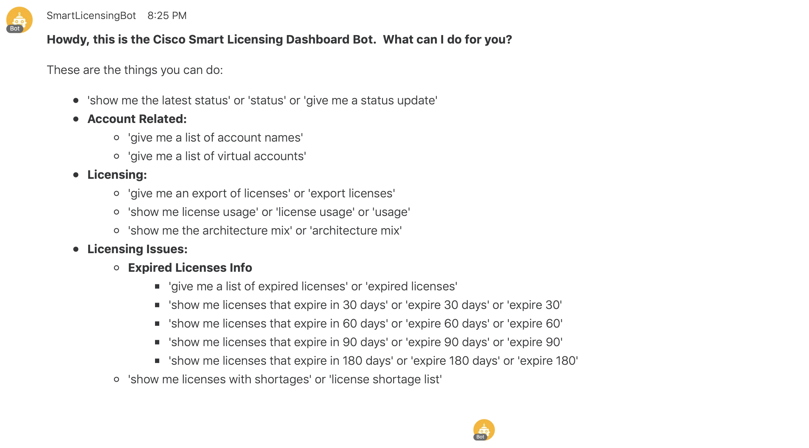
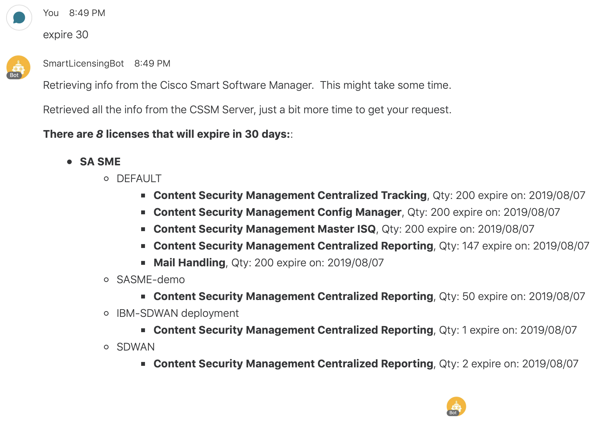
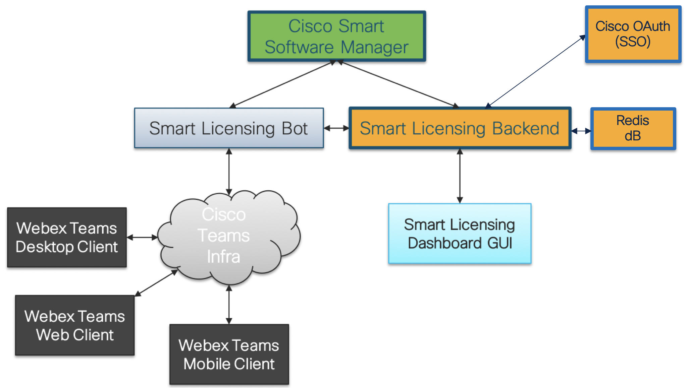
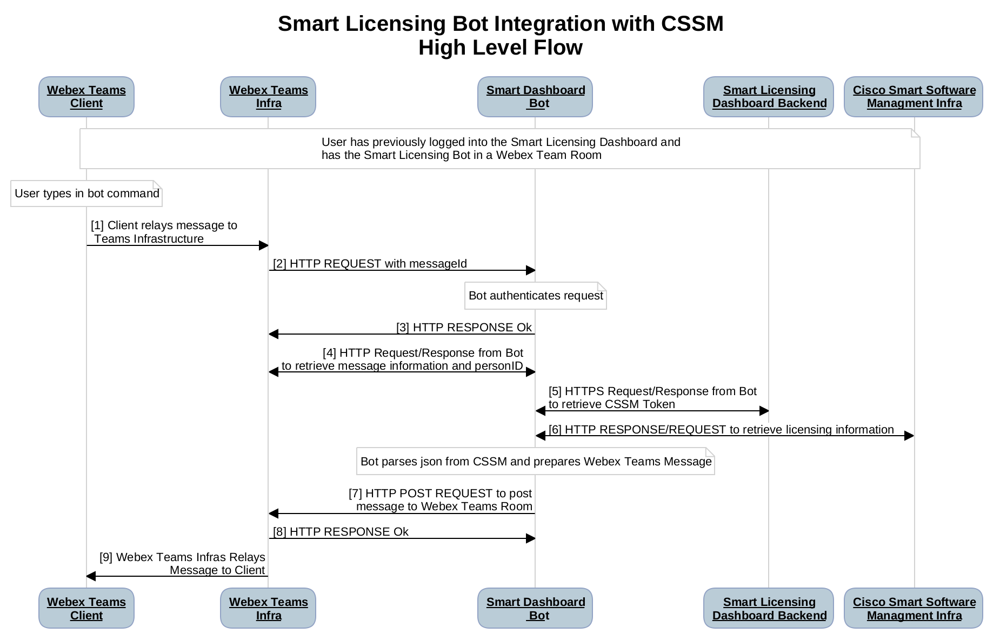
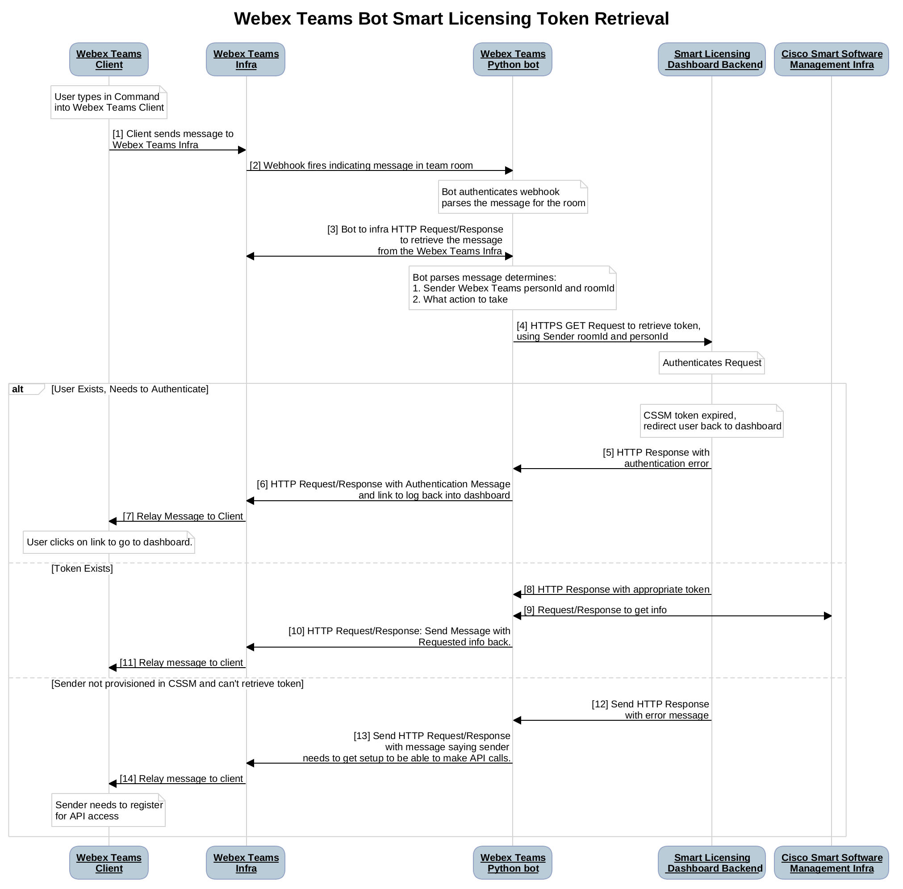
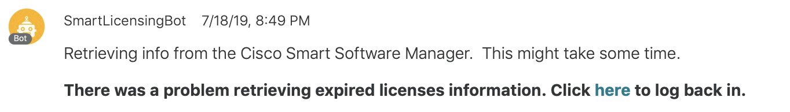
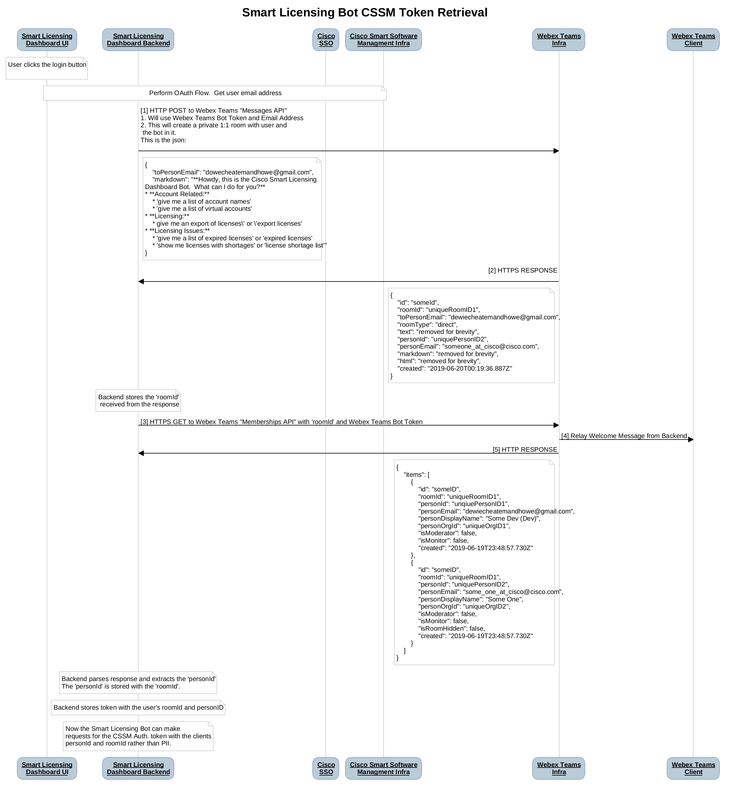

# Smart Licensing Bot Webex Teams Integration
## Description
The Smart Licensing Bot (bot) provides an intuitive and easy to use interface to your [Cisco Smart Software Manager (CSSM)](https://www.cisco.com/c/en/us/buy/smart-accounts/software-manager.html) smart accounts via integration with the industry leading and extremely useful [Webex Teams](https://www.cisco.com/c/en/us/solutions/collaboration/webex-teams.html) application.

Essentially the bot acts on behalf of the user, pulling useful information from CSSM and then reformatting in summary form for viewing on a Webex Team Client.
 
 Nothing will take the place of the Smart Licensing Dashboard in terms of visualizing your smart accounts and licenses. However, Webex Teams provides a quick and easy way of getting pertinent information on just about anything related to your CSSM smart accounts.

## Usage
When a user logs into the Smart Licensing Dashboard Webpage, the bot automatically creates a Webex Teams Space with the user.  For the user's convenience, the bot automatically sends a help message so the user is able to start sending commands right away.



When interacting with the bot, the user is able to request the following:
* Smart Accounts and Virtual Account Names
* A list of the expired licenses
* A list of licenses that are in shortage
* A list of licenses that expire in 30, 60, 90, and 180 days
* The architectural mix of the their licenses
* A detailed CSV export of all the licenses
* The license utilization
* Summarized status of the users licenses

For example, when the user types
 ```
 expire 30
 ```
 The bot will retrieve the licenses that expire in the next 30 days.


## Bot High Level Architecture and Design
The bot high level architecture can be seen in the figure below.  The bot acts as a gateway of sorts between the Webex Team Clients and Infrastructure and the Cisco Smart Software Manager (CSSM).


The main interfaces of the solution are:
1. Webex Teams <-> Smart Licensing Bot: 
    * Secure Webhooks are used to notify the Smart Licensing Bot about activity in spaces that it is in;
    * The Smart Licensing Bot uses the [Webex Teams API](https://developer.webex.com/docs/platform-introduction) to retrieve new messages, post new messages, and post files.
2. The Smart Licensing Bot and Backend exchange the CSSM OAuth token via a secure and authenticated REST interface.
3. The Smart Licensing Bot retrieve the user's licensing information via the [CSSM REST Interface](https://anypoint.mulesoft.com/apiplatform/apx/#/portals/organizations/1c92147b-332d-4f44-8c0e-ad3997b5e06d/apis/5418104/versions/102456/pages/309233)

Interesting design highlights for this implementation are as follows:
#### Inter-Application Authorization and Security
Because the Smart Licensing Backend and the Smart Licensing Bot are different microservers/applications AND the CSSM authorization token allows access to sensitive information, the REST interface between had to be secure and use authentication.

To aid in this operation, the class WBXTeamsBEIntegration was created.  It's usage in the main web app can be seen in the code for ```retrieve_be_token``` code below.

```python
def retrieve_be_token(be_secret_key, roomId, personId):
    rest_verb = 'GET'

    t = dt.datetime.utcnow()

    the_time = t.strftime('%Y%m%dT%H%M%SZ')

    headers = {'X-SLD-Date': the_time,
               'Content-Type': 'application/json'}

    token_request_url = "{}{}&personId={}".format(url_base, roomId, personId)

    # Create the signature so that the BE can verify authenticity of our request
    logger.info('{},    generating signature\n'.format(dt.datetime.now()))

    the_signature = WBXTeamsBEIntegration.signature(be_secret_key, headers, rest_verb, token_request_url,
                                                    json.dumps({}), be_service_name)
    logger.info('    signature generated\n')

    headers['X-SLD-BOT-Signature'] = the_signature

    # Send the request
    logger.info('    sending request to BE server\n')
    response = requests.get(token_request_url, json=json.dumps({}), headers=headers)
    logger.info('    received response from BE server\n')

    the_token = ""
    request_successful = False
    response_dict = {}

    if response.status_code == 200:
        # Check the response signature to verify authenticity
        headers = {'X-SLD-Date': response.headers['X-SLD-Date'],
                   'Content-Type': 'application/json'}

        response_signature = response.headers['X-SLD-BE-Signature']
        response_json = None
        try:
            response_json = json.dumps(response.json())
        except:
            logger.info(" no response body")

        calculated_response_signature = WBXTeamsBEIntegration.signature(be_secret_key, headers,
                                                                 'Response',
                                                                 "",
                                                                 response_json,'X-SLD-BE-Service')

        if response_signature == calculated_response_signature:
            logger.success('Response signature authenticated')
            request_successful = True
            response_dict = json.loads(response.text)
            the_token = response_dict['access_token']
        else:
            logger.error('Response NOT signature authenticated')


    return request_successful, response.status_code, the_token
```
#### Pandas DataFrames
The bot was designed for speed and flexibility.  Because it could potentially handle very large data sets, after retrieving the licensing information from CSSM, the bot puts it into a Pandas Dataframe.  Pandas is an open source data analysis toolkit that enables developers to manipulate large data sets quickly and easily.  The following code is a method within the ```CSSMLicense``` object.  It is called whenever we need to send license expiration information to the user:
```python
    def cssm_expired_licenses_df(self):
        df = self.cssm_dataframe
        expired_df = df[df['endDate'] < datetime.now(timezone.utc)]
        return expired_df.sort_values(by=['endDate'], ascending=True)
```

In addition to providing speed and flexibility, since all of the data is in a Pandas Dataframe, additional functions can be added fairly quickly.

#### Caching of Licensing Information
Another optimization done for performance reason is caching of the licensing information.  While the initial request for information will take some time because the bot pulls down all of the licensing information, subsequent requests will take a fraction of the time due to caching.

As can be seen in the code snippets below, we use [cachetools' TTLCache](https://cachetools.readthedocs.io/en/stable/) object to handle our caching.

First the initialization:
```python
# We cache our data for a few minutes so that subsequent requests from the client do not take too long.
license_cache = TTLCache(maxsize=100, ttl=300)
```

and then the implementation:
```python
# We are caching the license information for a few minutes so that response time to the user is faster.

@logger_wraps()
@cached(license_cache)
def get_cssm_license(room_id, bot_token, account_credentials=""):

    # Provide feedback to the user that fetching the info will take some time.
    please_wait_message = "Retrieving info from the Cisco Smart Software Manager.  This might take some time."
    x = threading.Thread(target=send_processing_status_message, args=(room_id, bot_token, please_wait_message))
    x.start()

    cssm_license = None
    request_successful = False

    # Retrieve the licenses
    smart_account = SmartAccountSDK(cssm_url, account_credentials)

    logger.info('entering smart_account.list_all_licenses()')
    request_successful, json_array = smart_account.list_all_licenses()

    logger.info('have exited smart_account.list_all_licenses()')
    logger.info('request_successful: {}\n'.format(request_successful))

    if request_successful:
        # Retrieving the licenses from CSSM was successful.  Update the user and parse the info into a CSSMLicense object
        retrieved_all_info_message = "Retrieved all the info from the CSSM Server, just a bit more time to get your request."
        send_processing_status_message(room_id, bot_token, retrieved_all_info_message)

        parser = cssm_parser.CSSMJSONParser(json_array)
        cssm_license = parser.cssm_license()


    logger.info('request_successful: {}\n, cssm_license: {}\n'.format(request_successful, cssm_license))

    return request_successful, cssm_license
```

Finally, whenever we need the licensing information for a particular user, we call the function
```python
request_successful, cssm_license = get_cssm_license(room_id, bot_token, account_credentials)
```


  
## Call Flows
### High Level Call FLow
The beginning of the flow, steps 1-4, are typical of a Webex Teams integration.  The Webex Teams Infrastructure fires a webhook toward the Smart Licensing Bot.  The bot authenticates the request and then retrieves the message.   

After retrieving the CSSM Authorization token (Step 5) from the Smart Licensing Backend, the bot then pulls the licensing information from CSSM via an HTTPS REST Request (Step 6). 

The bot then packages the information into a readable format and posts it to Webex Teams.

### CSSM Authorization Token Retrieval
Before the bot is able to send requests to CSSM, it first needs an authorization token.  The following call flow details how the token is retrieved from the Smart Licensing Dashboard Backend.  


The Smart Licensing Dashboard Backend stores a tuple of the Webex Teams personId, roomId and the acess token.  In the request, the bot will send, among other things, the user's roomId and personId.  The backend will take that information and look up the authorization token. 

There are three different scenarios that this flow handles.
* **Token Exists** - If the token exists, it is sent back in the response.
* **Token Does Not Exist** - If the token does not exist, an error is sent back to the bot. If the token does not exist, it means that the token has expired and the user needs to go through the OAuth process again.  The bot then informs the user that they need to log back into the Smart Licensing Dashboard.  Fortunately, the user is provided with a link to the dashboard in the message 



* **User Doesn't Exist on Dashboard** - Finally, if the user isn't registered, an error is sent to the bot, and the bot informs the user that they need to log into the dashboard.

### Smart Licensing Backend Token Retrieval and Caching

The following figure shows the flow for how the Smart Licensing Backend retrieves the CSSM Authorization Token and associates it with the newly created Webex Teams space that it opened for the user and the Smart Licensing Bot.


One the OAuth flow between Cisco SSO and CSSM is complete and the backend has the CSSM authorization token, we need to have a way to associate the token with the user that does not store Personally Identifiable Information (PII).  

In order to do this, we:
1. Create the Webex Team Space, populating it with the user and the Smart Licensing Bot.  This gives us the Webex Teams roomId.
2. Send a welcome message to the user.
3. Get a list of participants in the room to get the Webex Teams personId.  

Then when the Smart Licensing Bot needs the authorization token, it just sends a REST request with the user's personId and roomId via REST request.  In this way, no PII is stored neither stored in the cloud or transmitted over the wire.

## Suggestions for Future Work
1. Integration with Amazon Alexa to get summarized information
2. Summarized graphical reports along with the status. i.e. charts showing architecture mix, bar chart showing quantity of licenses v. future expiration date.
3. Notifications of pertinent events to the Webex Teams Space for things like upcoming license expiration, newly expired licenses, licenses in grace period, etc.
4. Ability to filter results according to virtual account.  This could be achieved fairly easily in code.  An elegant way of handling it via command within Webex Teams need to be thought about.
```python
    def cssm_expired_licenses(self, va_filter_list=[]):
        expired_df = self.cssm_expired_licenses_df()

        if len(va_filter_list) > 0:
            expired_df = expired_df[expired_df['virtualAccount'].isin(va_filter_list)]

        return self.cssm_prepare_expired_licenses_dict(expired_df)
```


